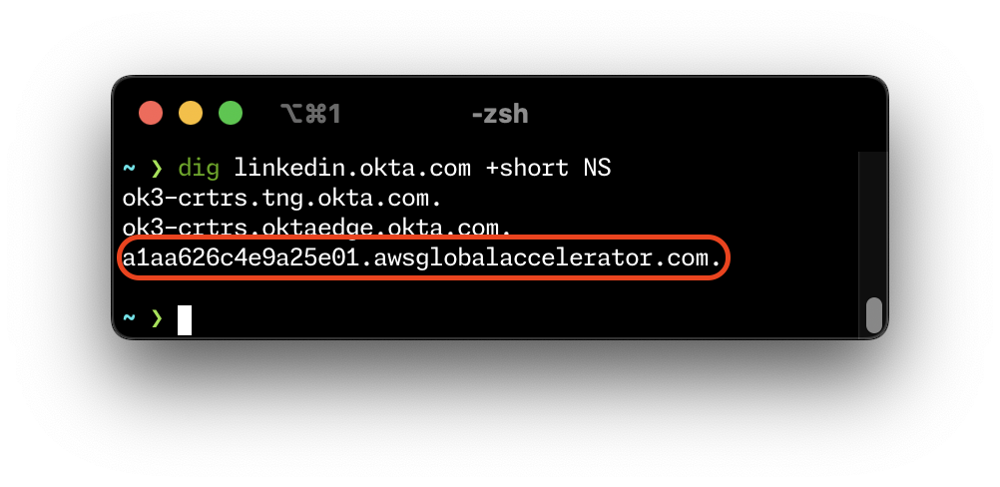
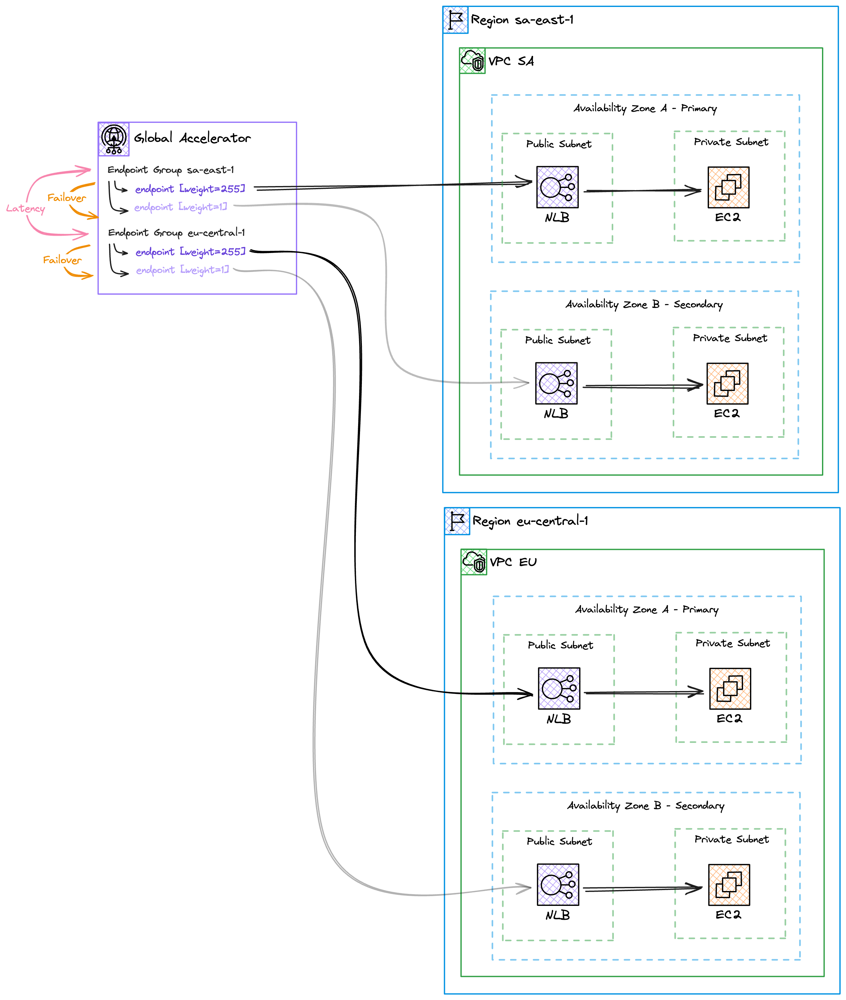
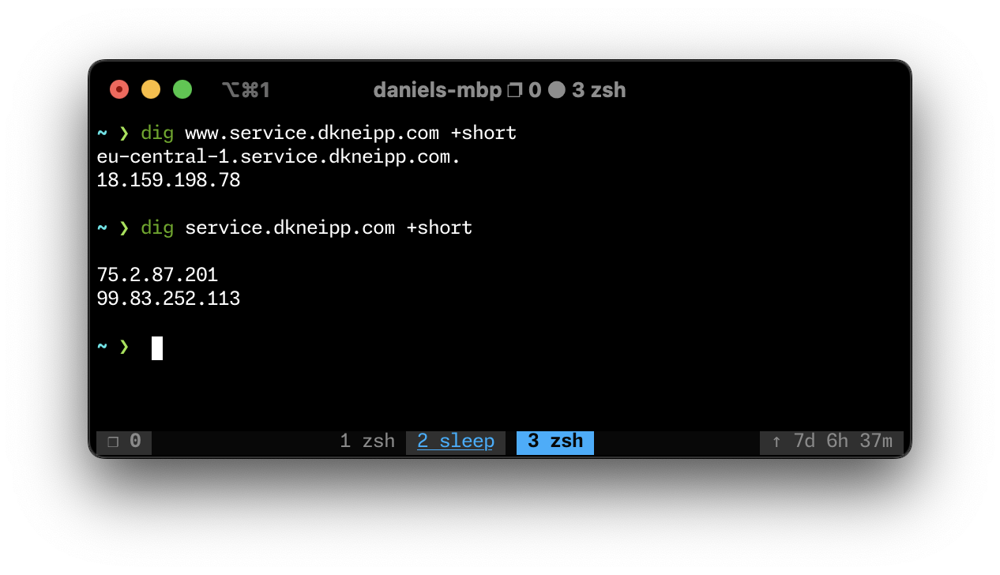
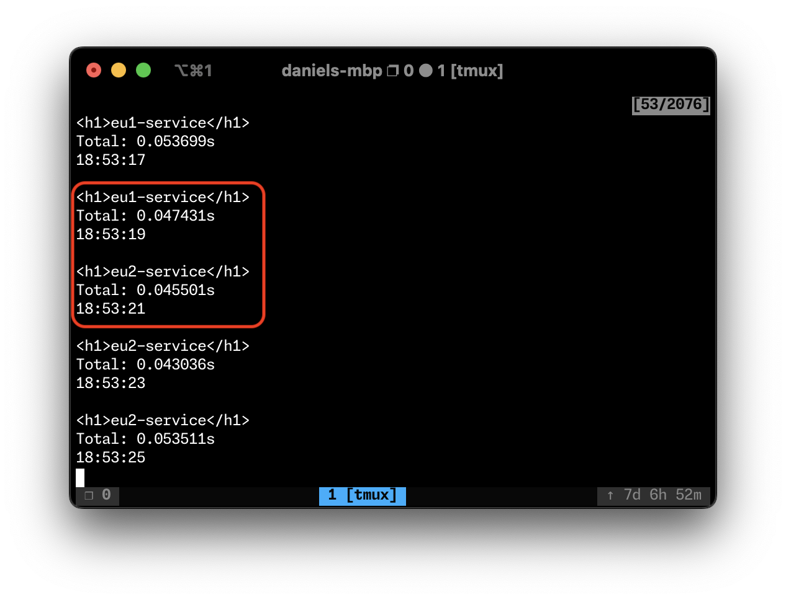
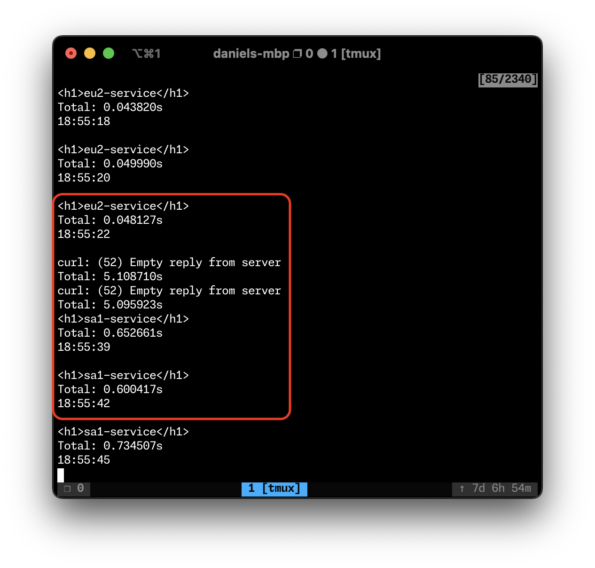
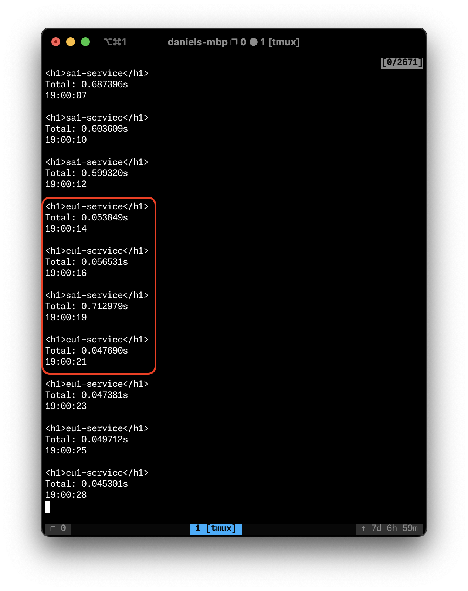
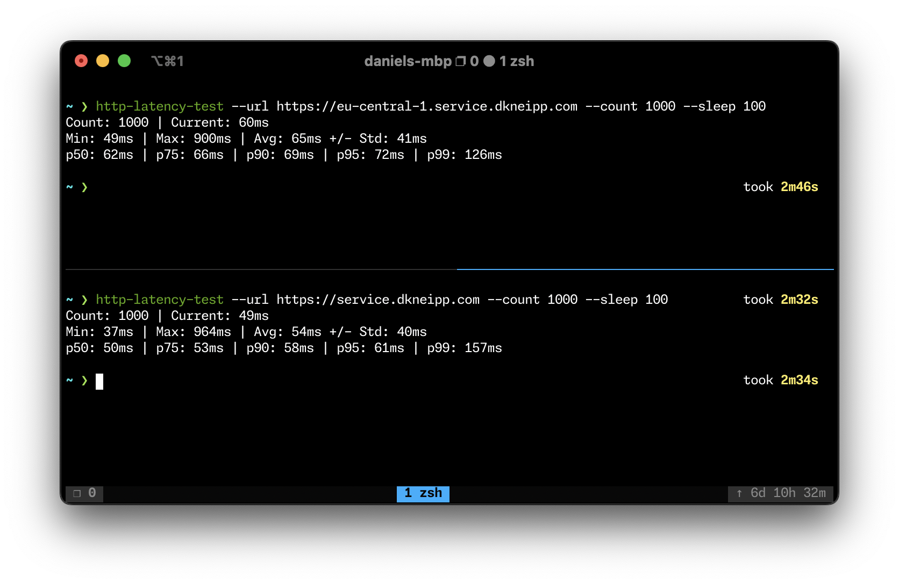
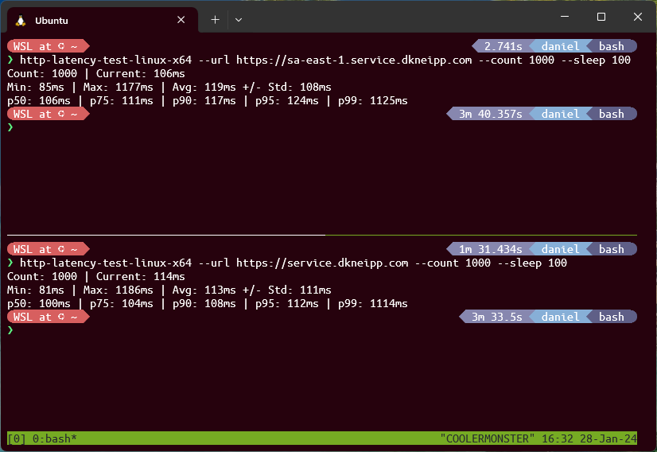

<!-- markdownlint-disable MD033 -->

# Global Service on AWS

In a [previous repository](https://github.com/DanielKneipp/aws-route53-global-dns) I showed how you can have a multi-region service running while keeping response times low using an architectural pattern called [Availability Zone Affinity](https://aws.amazon.com/blogs/architecture/improving-performance-and-reducing-cost-using-availability-zone-affinity/)

However, the previous design has a considerable issue: it doesn't perform a regional failover. In other words, if an entire region goes down, the service will become inoperable for the customers closer to that specific region.

To overcome this problem, this project shows how [Global Accelerator](https://aws.amazon.com/global-accelerator/) can be used to provide a single point of entry to your service with static IPs available globally.

## Working with Global Accelerator

So, to improve the previous design, we will add on top it a new entrypoint using Global Accelerator (GA). This AWS service offers a global fixed endpoint with two static IPs.

When a web client uses this endpoint, its traffic is sent to the nearest point of presence of the AWS Edge network, and from there it goes through the AWS backbone instead of going through the Internet all the way to the intended resource (which can be a load balancer or an EC2 instance).

GA is used by several [customers](https://aws.amazon.com/global-accelerator/customers/). Let's take [Okta](https://www.okta.com/) as an example. Okta follows a multi-tenant architecture and has subdomains for their customers, and you can see for LinkedIn the GA endpoint available as a `CNAME` record as shown in the image below

<p align="center">
  
</p>

> Feel free to test it on other [Okta customers](https://www.okta.com/customers/) such as Zoom for example, to see a different GA endpoint.

AWS also provides a webpage that allows you to see the differences in response times from different regions when you use GA as opposed to going via the public Internet to reach an AWS endpoint: https://speedtest.globalaccelerator.aws/

## Implementing the Design

GA alone can provide the same features Route53 offers with latency-based and failover records. So it could replace all of that. However, in the code, we will keep everything deployed previously to allow some comparisons between the approaches.

In summary, in the place of Route53, using GA in the design looks something like this:



> To understand step by step how the design was made, please visit the [`aws-route53-global-dns`](https://github.com/DanielKneipp/aws-route53-global-dns) to learn more.

A new file has been added at `aws-route53-global-dns/terraform/ga.tf` with all the relevant code there. This change was made in a separate branch so we can keep track of changes made and leave the previous project untouched.

GA follows a component hierarchy of listener -> endpoint group -> endpoint.

Listeners define the port and network protocol to listen to and which endpoint groups should receive the traffic.

Endpoint group describes a regional group of endpoints, which can be Application Load Balancers, EC2 instances, or in this case, Network Load Balancers (NLBs). For each endpoint you can set a weight which is used to define how the traffic to that endpoint group will be balanced.

In the code you can see endpoints defined as follows:

```terraform
endpoint_configuration {
  client_ip_preservation_enabled = false
  endpoint_id                    = module.services_eu["eu1"].nlb_arn
  weight                         = 255
}
endpoint_configuration {
  client_ip_preservation_enabled = false
  endpoint_id                    = module.services_eu["eu2"].nlb_arn
  weight                         = 1
}
```

With the above configuration, we are defining that the primary endpoint in the EU (`eu1`) should receive 255/256 of the traffic. Meanwhile, the secondary endpoint used for failover received 1/256.

An endpoint with weight 0 doesn't receive traffic if another endpoint group has healthy endpoints. In other words, if we had the `eu2` weight set to 0 and `eu1` stopped working, the traffic would failover to the other region, and not the `eu2`

⚠️ Note: failover cluster receives a small portion of traffic (1/256 = 0,39%), which makes the design a [active-active setup](https://docs.aws.amazon.com/Route53/latest/DeveloperGuide/dns-failover-types.html#dns-failover-types-active-active), in contrast to the active-passive configuration we had before. This has the benefit of ensuring that the failover cluster is always operational by receiving a portion of customer traffic at all times.

> As another implementation detail: as of now, GA doesn't support [client IP preservation](https://docs.aws.amazon.com/global-accelerator/latest/dg/preserve-client-ip-address.html) when the traffic is being forwarded to a NLB with a TLS listener. That is why you see `client_ip_preservation_enabled=false`

Only this addition is enough to be able to test GA without impacting the existing infrastructure, which shows the benefit of having a progressive design that allows improvement by composition with minimal change to existing components.

## Testing the Design

As mentioned before, a new branch `global_accelerator` has been created on the `aws-route-53-global-dns` project with the changes required to add the GA.

In order to deploy the whole thing, just do:

```bash
cd aws-route53-global-dns/terraform/
tf apply
```

The deployment can take several minutes. For more information regarding the deployment procedure, please refer to [this more detailed description](https://github.com/DanielKneipp/aws-route53-global-dns?tab=readme-ov-file#deploy).

The previous domain names are still working so we can test them and compare the differences. To hit the GA you can use the domain name such as `service.dkneipp.com`. To reach the closest primary NLB you can use `www.service.dkneipp.com`, as shown below.

<p align="center">
  
</p>

💡 From the domain name using the Global Accelerator, we can see the two [AnyCast IPs](https://aws.amazon.com/global-accelerator/features/#Static_anycast_IP_addresses). So, even in the event of a regional failover, the IPs of your service don't change, which allows customers to define network policies for your service only based on IPs if required.

> Note: now `service.dkneipp.com` works. As opposed to the limitation of `CNAME` records, the `A` record of type `alias` used for the GA endpoint can overlap with the `SOA` record of the zone.

Now, let's do some testing.

### Failover

To simulate an issue in one of the web servers, the instance is removed from the associated target group (as shown [here](https://github.com/DanielKneipp/aws-route53-global-dns?tab=readme-ov-file#test-failover))

After that, you can see that external web clients are seamlessly redirected to the secondary web server, as shown below:

<p align="center">
  
</p>

> This is the command used to perform the test shown above:
>
> ```bash
> while true; do sleep 2 && curl -w 'Total: %{time_total}s\n' 'https://service.dkneipp.com' && date +%T && echo ""; done;
> ```

This was also performed in the [previous project](https://github.com/DanielKneipp/aws-route53-global-dns). The interesting addition is the cross-region failover. And after all the web servers in the region are taken down:

<p align="center">
  
</p>

You can see the failover happening automatically, and the web server on the other region starts to respond to the traffic (now with much higher response times, but still with the service operational). *However, in this case, the failover was not transparent, and the end user would have experienced issues for around 17 seconds.*

And finally, once the primary web server is live again, the recovery is also automatic after a transition window, as seen below:

<p align="center">
  
</p>

### Response times

In order to get more interesting statistics (like average with standard deviation and percentiles) over response times, I've created a small utility in Go that can be used to get those from response times of `GET` requests to a specified URL.

The code of the utility is in `http-latency-test/`. Binaries for MacOS on ARM and x86 Linux have been built already, and you can use the `Makefile` to build a binary from the source if required.

The utility accepts the following arguments.

- `-count`: Max number of requests. Pass 0 to keep it running forever;
- `-sleep`: The amount of time in milliseconds to wait between requests (default is 500ms);
- `-url`: The endpoint to make the request.

So, a simple test can be `./http-latency-test --url https://service.dkneipp.com --count 1000 --sleep 100`.

With this tool, a test was performed to compare the response times of GA compared to hitting the closest NLB directly. This was done for both Europe and South America regions and the results are shown below.

| Europe                                       | South America                                |
|----------------------------------------------|----------------------------------------------|
|  |  |

The interesting thing to point out is that the Global Accelerator has the same or better response times than hitting the NLB directly. For the European region, we can see an improvement of 22% in the response times on average! 🤩

> However, this varies by region and also depends on several networking factors, such as the location of the web client and its Internet connection conditions.

As mentioned before, this improvement is due to the network path that is taken by the packets when the request is made. When using the NLB, the traffic goes through the internet before reaching the AWS resource. However, when using GA, the traffic goes through the AWS backbone as much as possible.

### Cleanup

A simple `terraform destroy` should delete all 127 resources.

## Conclusion

This project shows how you can use the AWS Global Accelerator to make a service globally available, resilient to failures in availability zones and entire regions, while also keeping response times low for users worldwide.

AWS Global Accelerator can be used for many other use-cases, such as [Blue-Green deployments](https://aws.amazon.com/blogs/networking-and-content-delivery/using-aws-global-accelerator-to-achieve-blue-green-deployments/), custom routing to build [sessions for online games](https://docs.aws.amazon.com/global-accelerator/latest/dg/about-custom-routing-how-it-works.html), or even just to provide a static IP and endpoint to customers without having to rely on DNS.

I encourage you to have a look if you manage AWS environments and don't know about this service.
